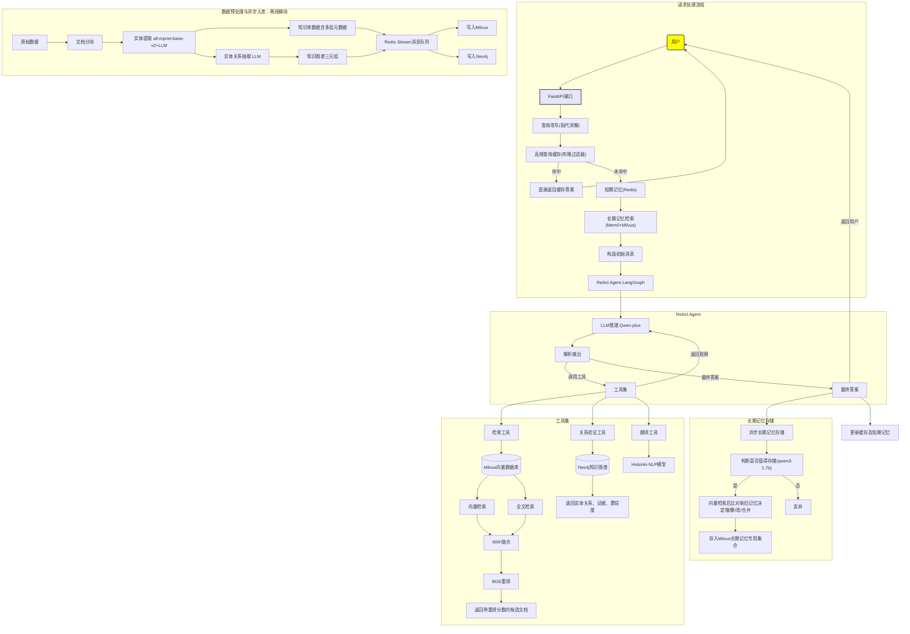
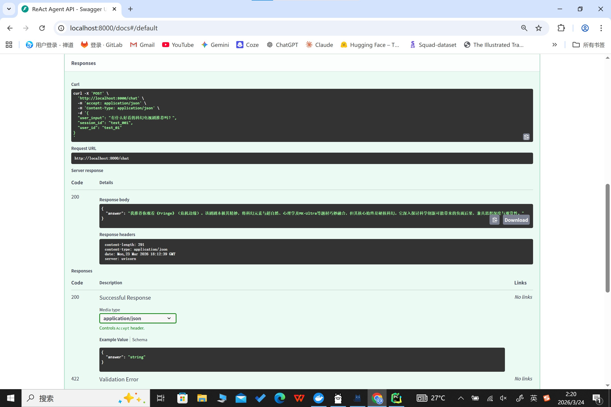
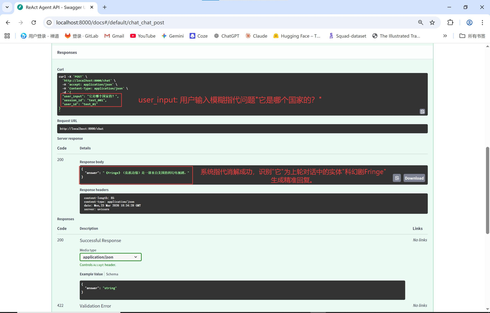
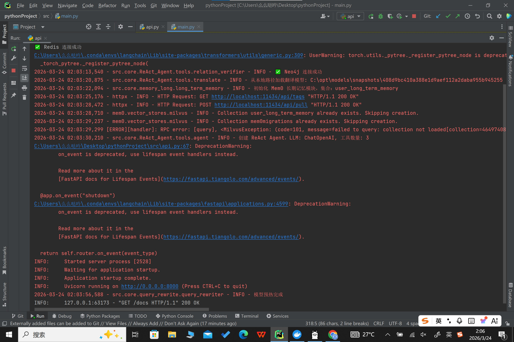
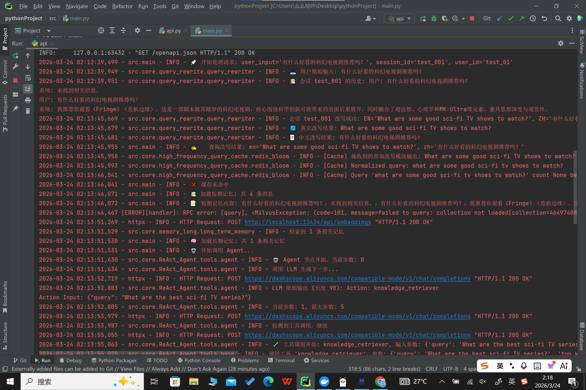
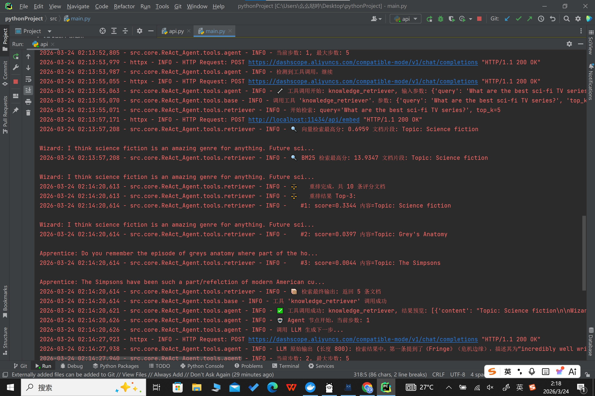
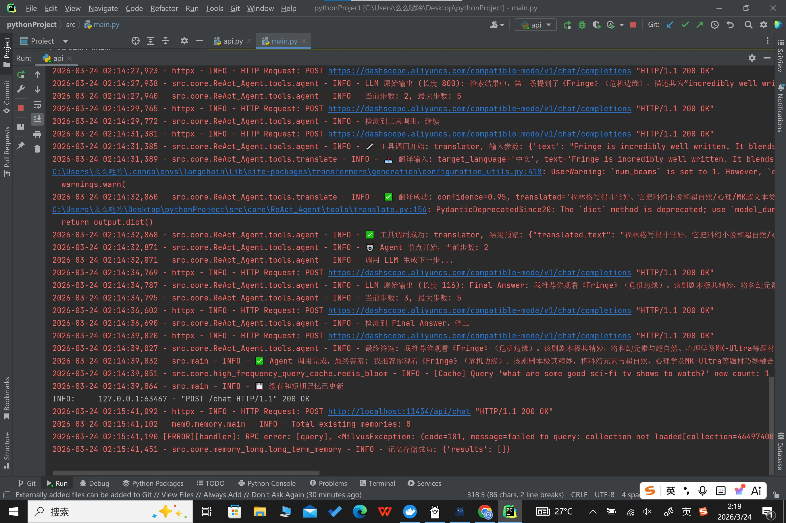

## 📖 项目简介

**ReAct Agent** + **Rag** 开发的**生产级多轮对话系统**。

系统支持**自主规划思考**, 通过 `LanGraph` 状态图编排规划多个工具集的自主调用，包括：混合检索、实体关系验证、翻译等工具。

系统支持**长短期记忆提取**，通过多级记忆（短期+长期）+ 查询改写(指代消解)，在多轮对话中保持上下文连贯、指代准确并能持久化存储用户画像。

系统支持**中英双语交互**，支持 "中文问-英文检-中文回复" 的完整链路，保证知识库为英文数据集的同时，支撑用户中文输入与系统中文回复。

检索工具集深度优化：引入 `Milvus2.6`版本新索引 `IVF_RabitQ` 加速向量检索，新方法`sparse` + `BM25 Function`实现**原生全文检索**，避免引入Elasticsearch增加数据库维护成本。

实体关系增强：引入 `Neo4j` 知识图谱存储实体关系类型、证据原文及置信度。对检索结果进行实体关系验证，进一步提升答案准确性，并支持多跳推理扩展。
  
## 🖼️ 流程图

## ✨ 核心亮点

### 1、多轮对话与指代消解
- **短期记忆**：`Redis Hash` + `Sorted Set` 存储最近 5 轮对话，提供会话上下文。
- **长期记忆**：`Mem0` + `Milvus` + `Qwen3-1.7b/Qwen3-4b` + `Nomic-embed-text` 构成有状态记忆层，实现用户画像动态演进。
    
    - **提取阶段**：Mem0 调用本地模型 `Qwen3-1.7b` 判断记忆是否值得存储，通过 `Prompt` 约束返回最多3条最重要的记忆并携带记忆类型(偏好/事实/事件)和重要性（0-1）标签。
    - **更新阶段**：Mem0 依次对候选记忆进行向量检索对比新旧记忆，传递给本地模型 `Qwen3-4b` 执行新增/更新/删除或合并操作，经过嵌入模型 `Nomic-embed-text` 向量化后入库，保证记忆不冗余不矛盾。
- **查询改写**：本地模型 `Qwen3-4B` 结合短期记忆 + `few-shot prompt` 进行**指代消解**，并将中文问题改写为独立英文检索问题，同时输出中文翻译。

### 2、ReAct Agent 自主规划与工具调用
- **Agent 核心**：`Qwen-plus` 模型（API）作为 ReAct Agent中驱，自主决定是思考、观察、行动(调用工具或生成答案)。
    
    - 选型原因：当前用 `Qwen-plus API` 替代。后期通过云服务器升级计算资源，本地部署 `Qwen3-30b-a3b` ，MOE架构3b激活参数模型专用于ReAct Agent开发，具备自主规划循环调用各工具集能力。

- **Agent 框架：LanGraph**
  - 基于有向图将 `ReAct` 循环显式拆解为 `思考-行动-观察` 节点，通过条件边动态控制分支。集成 `CoT` 思维链，强制 LLM 在每次决策前输出推理步骤Thought，实现 `先思考后行动` 的显式规划。

- **工具集**：
  - **检索工具**：`双路召回（ 向量检索 / BM25全文检索）+ RRF 融合 + BGE-reranker-v2 模型重排`，输出 Top-5 候选文档并附带重排评分，确保生成高可信度结果。
  - **实体关系验证工具**：Neo4j 图数据库已存储 `知识图谱三元组`，包含`实体关系、证据原文及置信度`。通过查询两个实体间的直接关系返回结构化证据，增强答案准确性并返回证据原文。
  - **翻译工具**：本地模型 `Helsinki-NLP/opus-mt-en-zh` 英转中模型将英文检索答案翻译为中文，支撑中文回复。

### 3、检索系统深度优化
- **向量索引**：`Milvus 2.6`+ 版本新索引 `IVF_RABITQ` 支撑向量检索 ，相较于`HNSW`等原主流索引内存占用极低（最高32倍压缩），且查询性能与召回精度皆超越其他索引。
- **全文检索**：`Milvus 2.6`+ 版本新功能，通过 `sparse` 字段 + `BM25 Function` 实现**原生全文检索**，无需额外引入Elasticsearch，增加数据库维护成本。
- **长期记忆存储**：Milvus 集合与知识库集合逻辑隔离，每条长期记忆包含`记忆类型与重要性标签`，支持时效性衰减混合排序。

### 4、数据预处理与知识图谱增强
- **实体提取**：源数据集送入本地模型 `en-core-web-trf` 抽取4种基础实体，LLM 抽取 11 种适配数据集的领域实体，入库的知识库数据包含实体类型元数据标签。
- **实体关系抽取**： LLM抽取实体关系，生成知识图谱三元组，存入图数据库Neo4j，支撑后续 Agent 系统的实体关系验证。
- **消息队列**：`Redis Stream + 消费者队列`实现，知识库数据和知识图谱数据多消费者并行写入 Milvus 和 Neo4j，大幅提升吞吐。

### 5、模型量化与部署
- **模型量化**：
    - `Qwen3-4b:Q4_K_M (Ollama GGUF)`: 查询改写模型经 `4bit量化`后，显存占用减少约4倍（约2.5GB），推理速度提升33%，精度几乎无损。
    - `Qwen3-1.7b:Q4_K_M (Ollama GGUF)`: 长期记忆提取模型经 `4bit量化`后，显存占用减少约3倍（约1.0GB），推理速度提升33%，精度几乎无损。
    - `BGE_reranker_v2`: 重排模型经 `ONNX FP16量化`，显存占用减少45%（约1.1GB），推理速度提升近一倍，精度几乎无损。
    - `en_core_web_trf`：NER提取模型经 ONNXRUNTIME `int8量化`，推理速度提升 30%，精度损失<1%。

- **部署**
    - 容器化：使用 `Docker Compose` 编排所有服务（Redis、Milvus、Neo4j、Ollama），实现一键启动完整环境，保证环境一致性。
    - API 服务：`FastAPI` 提供高并发异步接口，将长期记忆模块异步化不阻塞 Agent 主程序。

## 📚 知识库选型：Wizard of Wikipedia (英文数据集)
  本系统采用 Facebook AI 发布的 Wizard of Wikipedia (WoW) 数据集作为核心知识库。包含 22k+ 多轮对话（训练集 18k、验证集 2k、测试集 2k），共覆盖 1.3k+个维基百科主题。

**选型理由**：
  - 跨领域覆盖：主题涵盖历史、科技、艺术、娱乐等领域，考验系统在不同类型主题查询下的检索与生成能力。
  - RAG 基准：作为学术界和工业界广泛使用的 RAG 评估黄金基准。
  - 高轮次：单条数据平均`9.15轮`对话，考验系统在多轮对话中的短期记忆连贯性与指代消解能力。
  - 知识密集：单条数据平均 `750-1000 tokens` 的适中长度，考验模型的长上下文处理能力。

**预处理后数据集特征**：
  - 分块后平均轮次：`3.0轮`
  - 分块后平均大小：`724字符`
  - 分块后目标范围（800-1800字符）：`25.5%`数据落于目标范围内，`74.5%`数据小于目标范围（源数据本身包含大量短文本），无数据超过目标范围。
  - 每100条数据关系密度：经`NER抽取`和`RE抽取`后，`每100条数据总实体数量1917`，`总关系数345`，`18%关系密度`合理。

  ## 🛠️ 技术栈与选型理由

| 组件 | 选型 | 理由 |
|------|------|------|
| **Agent 框架** | LangGraph | 原生状态图编排可精细控制思考-行动-观察循环，实时跟踪工具调用状态与模型决策路径，支持定义循环上限防止无限循环 |
| **ReAct Agent 模型** | Qwen-plus (API) | 大参数模型确保支撑ReAct Agent能精准解析输出、稳定执行工具调用。百炼平台提供百万token Free额度，零成本支撑当前阶段开发与测试，后期用Qwen3-30b-a3b替换 |
| **重排模型** | BGE CrossEncoder (本地) | Hugging Face 成熟专业重排模型|
| **翻译模型** | Helsinki-NLP (本地) | Hugging Face 成熟中英翻译模型 |
| **改写模型** | Qwen3-4B (本地Ollama) | 在Qwen3-1.7b、4B、8b测试中精度与速度平衡最佳 |
| **嵌入模型** | nomic-embed-text (本地Ollama) | 开源轻量嵌入模型的性能标杆，参考MTEB评分及主流选择。统一用于知识库向量化、用户查询向量化及长期记忆向量化，确保语义检索一致性 |
| **长期记忆模型** | qwen3-1.7b/4b (本地Ollama) | 记忆提取本质为轻量级信息筛选，参考Mem0官方基准小size模型为黄金选择。记忆更新使用稍大模型，确保新旧记忆增删改的准确性 |
| **长期记忆框架** | Mem0 | Mem0有内置状态记忆层，自主决策执行 LLM调用、向量检索、新旧记忆的新增/更新/删除/合并，只需prompt引导生成携带记忆类型等元数据的输出。前期使用Langmem开发，过于demo化，代码重构升级为Mem0 |
| **API 服务** | FastAPI | 异步原生，支撑长期记忆异步写入不阻塞agent主程序 |
| **向量数据库** | Milvus 2.6 |IVF_RABITQ向量索引内存占用低且召回率高，sparse+BM25function实现原生全文检索，避免额外引入Elasticsearch降低数据库运维成本，同时通过逻辑分离知识库集合与长期记忆专用集合，保证知识库环境干净 |
| **图数据库** | Neo4j | 知识图谱实体关系存储支持多跳验证，弥补系统多跳问题推理能力不足 |
| **缓存+短期记忆数据库** | Redis-Stack | 内存数据库提供低延迟读写适合短期记忆存取，内置布隆过滤器支撑高频查询缓存过滤 |
| **消息队列** | Redis Stream | 基于现有 Redis 基础设施，轻量级解耦知识库与知识图谱的异步入库，避免引入外部中间件Kafka增加系统复杂度 |
| **模型量化** | ONNXRUNTIME | 相比Optimum方法更底层、可定制化量化范围更广 |
| **日志监控** | LangSmith + 本地logger | 自动提取所有由LangGraph开发的日志减少开发量，本地logger日志兜底 |

## 📸 演示截图

| FastAPI 单轮对话请求与响应示例 | FastAPI 多轮对话成功指代消解示例 |  |
|-------------|---------|-------------|
|  |  |
  
| 完整请求日志1 | 完整请求日志2  | 完整请求日志3  | 完整请求日志4  | 
|---------------|---------------|---------------|---------------|
|  |  |  |  |

## 🚀 后续优化方向
  - **推理引擎升级**：
      - 将核心模型`Qwen3-4B`、`Qwen3-1.7B`从 `Ollama 迁移至 vLLM`，利用 `PagedAttention` 与连续批处理技术提升推理速度。
      - 将`重排模型、翻译模型`从 `GPU` 迁移至 `CPU（ONNX Runtime 加速）`，释放 GPU 显存用于核心 LLM 推理，利用 CPU 多核并行满足重排与翻译的低延迟需求。
      - 预期在`单卡A10支撑8-12稳定并发`，`首Token延迟降低30%`，`吞吐提升3-5倍`。
 
  - **实体关系验证增强**：
      - 知识图谱三元组数据添加`有向关系`，为`多跳路径`提供明确方向。当前知识图谱仅包含`关系类型、置信度和证据原文`。
      - 添加`实体类型标签（知识库已有字段）`：多跳查询中按类型过滤是必要前提，否则路径会混杂无关节点。
      - 扩展实体关系验证工具，支持 `Cypher 多跳查询（[*1..3]）`，实现复杂路径推理，提升系统多跳推理能力。

## 📁 项目代码结构
    ├── config/ - 配置文件
      ├── congig_paths.py  # 集成配置管理
      ├── paths.py  # 集成路径管理  

    ├── src/ - 核心源代码
      ├── main.py  # 核心处理逻辑
      ├── api.py  # FastAPI 异步服务入口
      ├── core/     
        ├── query_rewrite/ - 查询改写
           ├── query_rewriter.py  # # 查询改写功能
           ├── query_rewriter_test_case.py  # 模块测试用例
           
        ├── high_frequency_query_cache/ - 高频查询缓存（Redis Bloom Filter）
           ├── redis_bloom.py  # 高频查询缓存功能
           ├── redis_bloom_test_case.py  # 模块测试用例
  
        ├── memory_short/ - 短期记忆（Redis Hash+SortedSet）
           ├── redis_short_memory.py  # 短期记忆提取 + 短期记忆注入功能
  
        ├── memory_long/ - 长期记忆（Mem0 + Milvus）
           |—— long_term_memory.py  # 长期记忆提取 + 长期记忆注入功能
           
        |—— reAct agent/  - Agent开发
            |—— tools/ 工具集
              |—— agent.py - # Agent 图构建与节点
              |—— base.py -  # 工具工厂
              |—— retrieval.py - # 混合检索重排工具
              |—— relation_verifier.py - # 实体关系验证工具
              |—— translate.py - # 翻译工具
              
        |—— redis-stream/ - 消息队列异步入库
              |—— producer.py -  # 生产者（推送至 Redis Stream）
              |—— milvus_consumer.py - # 消费者：写入 Milvus
              |—— neo4j_consumer.py - # 消费者：写入 Neo4j
              |—— create_milvus_collection.py - # 创建Milvus知识库集合及索引（运行一次）
              |—— long_memory_collection.py - # 创建Milvus长期记忆集合及索引（运行一次）
              |—— megrate_milvus.py - # Milvus知识库迁移（支撑BM25全文检索，运行一次）
              |—— megrate_milvus_test.py - # Milvus迁移测试用例（运行一次） 
            
      |—— chunking/ - 数据预处理模块
      ├── models/ - 本地模型
      ├── quantization/ - 量化后模型
      ├── data/ - 源数据
      ├── .env.example - 环境变量模板（示例，原文件不提交）
      ├── .gitignore - Git 忽略文件
      ├── docker-compose.yml - Docker Compose 编排文件
      ├── Dockerfile - 应用镜像构建文件
      ├── requirements.txt - Python 依赖列表
      ├── README.md - 项目说明文档
